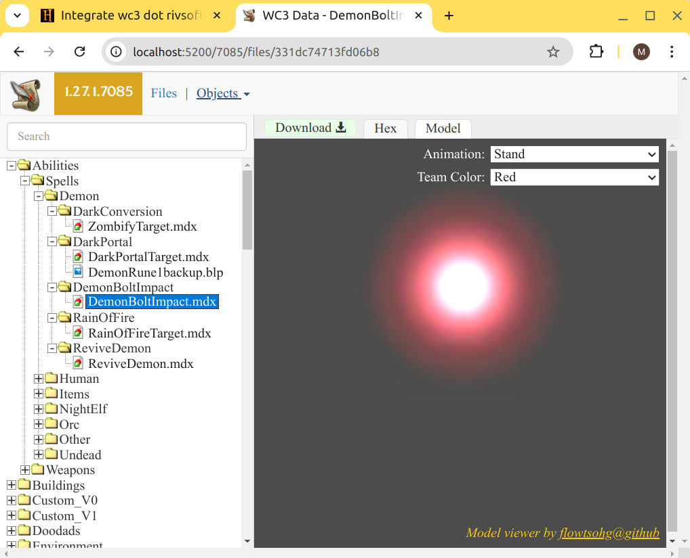

# WC3DataHost
WC3DataHost is a part of `Mpq viewer` tool.

WC3DataHost is the http host serving Mpq resources.

WC3DataHost serving Mpq resources to and processing requests from web browser.



## What supports
- Browsing W3X, W3M, MPQ, and CASC data in a tree structure and examining their contents.
- Displaying entire map terrains in a 3D view.
- Analyzing object data presented in tabular or textual formats.
- Inspecting core Warcraft data directly within your browser.

Quoting the original author:
> This is essentially a rebirth of RMPQEx (if anyone recalls), fully transitioned to a web platform.
All operations occur locally in your browser—the map files are never uploaded to the server. Data is cached locally for your convenience.
Discover more at: <https://www.hiveworkshop.com/threads/online-wc3-map-data-viewer.310774/>


## Run mpq viewer
1. Clone this repository
2. Download [wc3hostAssets](https://drive.google.com/file/d/1cusUHkkwODopV39KQw9x6wyPbWBKULyz/view?usp=drive_link) and extract it to somewhere.
3. Add a env to point to the resource files.
`WC3DATA_HOME=~/wc3hostAssets/`
4. Also copy the www folder in repository to the path which WC3DATA_HOME point to.
5. Compile and boot WC3DataHost with IDEA.

## 
    Q: But the wc3hostAssets already contains `www`?
- A: The `www` in wc3hostAssets is a initial version, later version is go with git repository.


    Q: Which version of Warcraft Mpq data is in wc3hostAssets?
 - `1.27.1.7085` is provided for now. To pack your own version, see steps below.


## How do I know files prerequisites is satisfied.
Assuming you have set `WC3DATA_HOME=~/wc3hostAssets/`,
also you put two folder there:
- `files` which is extracted from downloaded all-wc3hostAssets.zip
- `www` which is copied from this repository

Then you got files structures:
```
~/wc3hostAssets/
~/wc3hostAssets/files
~/wc3hostAssets/www
```

You got there if these file exists:
```dtd
~/wc3hostAssets/files/images.dat
~/wc3hostAssets/www/index.html
```


## How to generate wc3hostAssets by myself?

Files in `www` folder is dist from repository `wc3data` web project part.

Files in `files` folder is created by a tool which is in repository `wc3data` too.

For original source code of wc3data, see https://github.com/d07RiV/wc3data

By the way, I forked `d07RiV/wc3data`, to generate the `files` with forked version, follow the step below:
   - Assuming you have a Warcraft III installation. TF version is supported, others is not promised.
   - Leverage the bundled `Mpq2Wc3data` utility.
   - Run with passing Warcraft III installation location, and an output location for the generated `files`.
   ```sh
   Mpq2Wc3data path/to/warcraft3/installation -o path/to/output/wc3data-files
   ```
Still some works should be done to make my fork of `wc3data` available on GitHub. 
